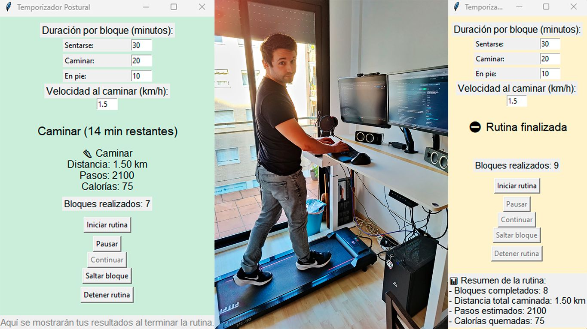

# Temporizador Postural

Este proyecto en Python implementa un temporizador postural con interfaz gráfica usando Tkinter. Está diseñado para fomentar hábitos saludables durante una jornada laboral de 8 horas, alternando entre estar sentado, caminar y ponerse de pie.



## 🎯 Características
- Interfaz sencilla con botones: iniciar, pausar, continuar, detener y saltar bloques.
- Configuración manual del tiempo de cada bloque.
- Indicadores visuales con emojis y colores para cada estado.
- Contador de bloques realizados en tiempo real.
- Estimación de pasos y calorías al caminar.
- Resumen visual al finalizar la rutina.

## ⚙️ Requisitos
- Python 3.x
- Solo compatible con Windows (utiliza `winsound`)

## ▶️ Ejecución
```bash
python temporizador_postural.py
```

## 💡 Compilar a .exe
```bash
pyinstaller --onefile --noconsole temporizador_postural.py
```

El archivo resultante estará en `dist/temporizador_postural.exe`.

## 🗂️ Estructura del repositorio
```
temporizador-postural/
├── temporizador_postural.py
├── README.md
├── requirements.txt
├── use_example.jpg
```

## 📄 Licencia
MIT License
